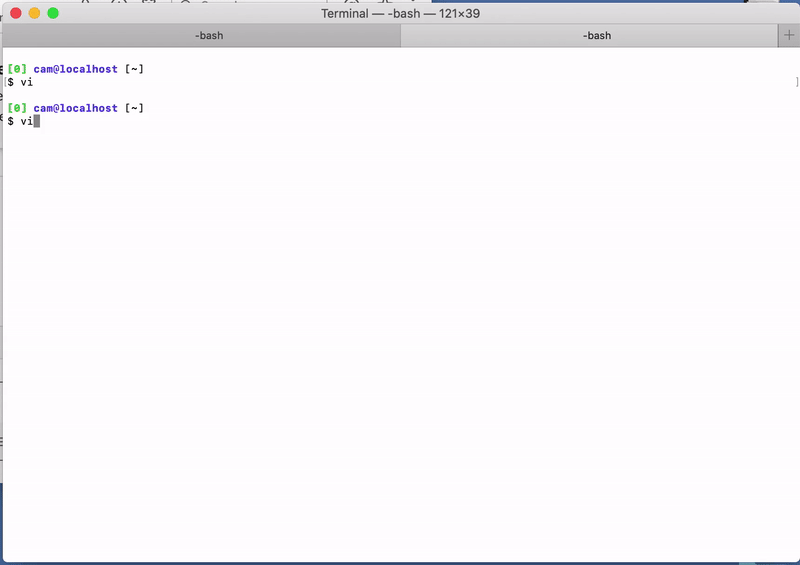

 ```
  ______     __         __     __    __   
/\  ___\   /\ \       /\ \   /\ "-./  \   Slack \ Vim
\ \___  \  \ \ \____  \ \ \  \ \ \-./\ \   Slack \ Vim
  \/\_____\  \ \_____\  \ \_\  \ \_\ \ \_\   Slack \ Vim
   \/_____/   \/_____/   \/_/   \/_/  \/_/    Slack \ Vim
```

## Disclaimer
* This is my first vim plugin and I know I am probably doing some things wrong, I would love to know how to make this better.
* This project is a work in progress 
* The goal is to write as much as possible of the app in vimscript and to use the outside world as little as possible

## Slack Workspace App

Create a new workspace app on your [Slack App Dashboard](https://api.slack.com/apps)

Go to `Add Features and Functionality` > `Permissions`

Under `User Token Scopes` add these scopes

```    
chat:write
team:read
users:read
channels:read
channels:history
groups:read
groups:history
im:read
im:history
mpim:history
mpim:read
```

## Vim Requirements

`+ conceal`

## System Requirements

`curl`

## Installation

Using [Pathogen](https://github.com/tpope/vim-pathogen)
    
    # if you have not used pathogen before add this to your ~/.vimrc
    execute pathogen#infect()

    # clone slim into your bundle dir
    cd ~/.vim/bundle
    git clone https://github.com/Colmbus72/slim.git

## Usage

### Getting started

    # Add this line to your ~/.vimrc to alias the command :Slack
    command! Slack :call slim#StartSlack()

Open vim and run `:Slack`



Enter your workspace token generated earlier `xoxp-xxx...`

**Test that the tokens have the correct permissions by running `tw<CR>`**

Run `:W` to generate all your workspace and channel files and overwrite anything in the .data/workspaces dir

### Commands

Mapping | Function 
--- | --- 
`:Slack` | Start slack
`<leader>l` | refresh the current channel page
`<leader>c` | change to channel list and start search
`<leader>b` | change to write buffer and insert at the end
`<leader>w` | send entire write buffer to slack as a message
`<leader>q` | close slack

### Demo


